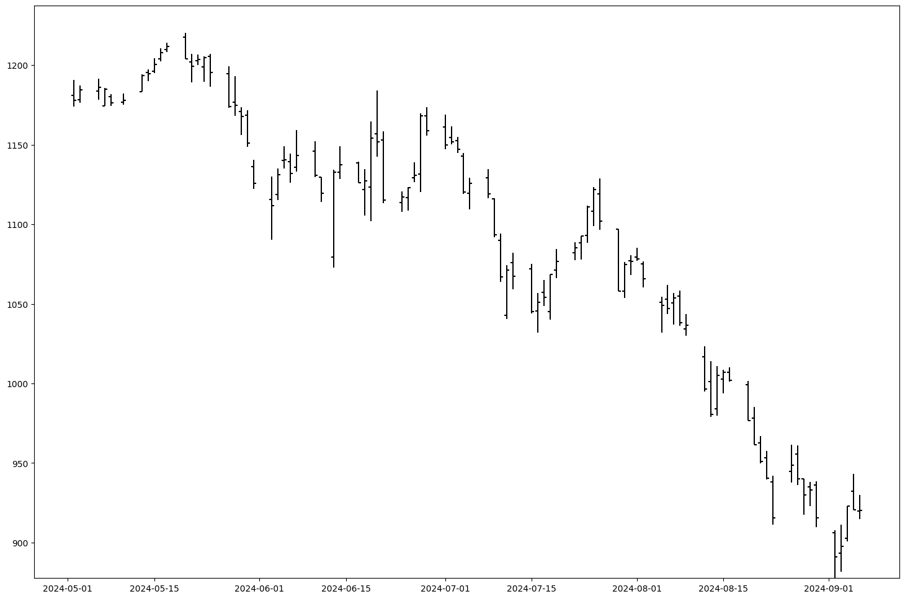

## Тема 2. Графический анализ
Это один из самых наглядных способов анализа, поэтому его используют и для предварительного анализа и в качестве подтверждения.
```python
import matplotlib.pyplot as plt
import pandas as pd
df = pd.read_csv('rtsi.csv', index_col=0, parse_dates=[0])
data = df['2024-05-01':].drop(columns='VALUE')
data.plot(figsize=(18, 12))
```

### 2.1 Свечной график
Для таких случаев в среднивековой Японии был придуман свечной график, в котором одному значению по горизонтали соответсвует сразу 4 значения.
```python
mask = data.CLOSE > data.OPEN
grow = data[mask]
grow_b = grow.CLOSE.sub(grow.OPEN)
grow_h = grow.HIGH.sub(grow.LOW)
fall = data[~mask]
fall_b = fall.OPEN.sub(fall.CLOSE)
fall_h = fall.HIGH.sub(fall.LOW)
plt.figure(figsize=(18, 12))
plt.bar(grow.index, height=grow_h, width=0.1, bottom=grow.LOW, color='g')
plt.bar(grow.index, height=grow_b, width=0.8, bottom=grow.OPEN, color='g')
plt.bar(fall.index, height=fall_h, bottom=fall.LOW, color='r')
plt.bar(fall.index, height=fall_b, bottom=fall.CLOSE, color='r')
plt.show()
```

### 2.2 График торговых баров
Это не единственный способ представления пятимерных данных. Можно даже не использовать цвет.
```python
plt.figure(figsize=(18, 12))
plt.bar(data.index, height=data.HIGH - data.LOW, width=0.2, bottom=data.LOW, color='k')
plt.scatter(data.index, data.OPEN, s=10, c='k', marker=0)
plt.scatter(data.index, data.CLOSE, s=10, c='k', marker=1)
plt.show()
```

